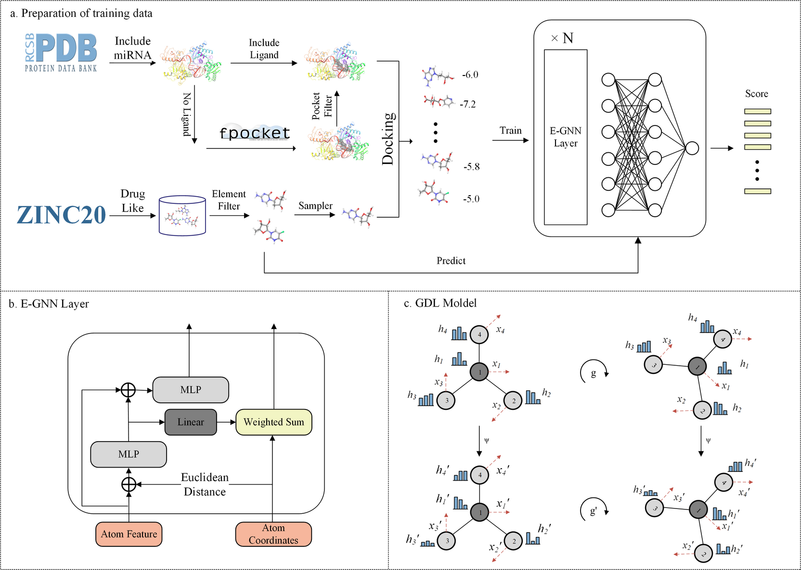

# Equivalent Graph Neural Network-based Virtual Screening of Ultra-large chemical libraries  Targeting miRNA-protein complex



## Contents

- [Equivalent Graph Neural Network-based Virtual Screening of Ultra-large chemical libraries  Targeting miRNA-protein complex](#equivalent-graph-neural-network-based-virtual-screening-of-ultra-large-chemical-libraries--targeting-mirna-protein-complex)
  - [Contents](#contents)
  - [Overview](#overview)
  - [Software Requirements](#software-requirements)
    - [OS Requirements](#os-requirements)
    - [Python Dependencies](#python-dependencies)
  - [Installation Guide](#installation-guide)
    - [download this repo](#download-this-repo)
    - [install karmadock_env](#install-karmadock_env)
  - [ligand docking](#ligand-docking)

## Overview

MicroRNAs (miRNAs) are pivotal post-transcriptional regulators within cells and hold immense therapeutic potential for a wide range of diseases. Despite this promise, the development of small-molecule drugs targeting miRNAs remains relatively scarce. There is a need to establish efficient screening methodologies for identifying small molecules that modulate miRNAs, thereby assessing the feasibility of miRNAs as druggable targets.
In this study, we initiated a rapid screening approach for small-molecule drugs that influence miRNA biogenesis. This approach combines structure-based virtual screening with an equivariant graph neural network. Four miRNA protein complexes associated with miRNA migration or preprocessing were selected as targets and lead compounds were screened in the druglike 3D small molecule dataset in the Zinc20 database which has 600 million compounds, respectively. Remarkably, the screening process for all four complexes was completed within 48 hours, utilizing minimal computational resources.

If you find it useful, please cite:

**Equivalent Graph Neural Network-based Virtual Screening of Ultra-large chemical libraries  Targeting miRNA-protein complex**
Huabei Wang; Zhimin Zhang; Guangyang Zhang, Ming Wen\* and Hongmei Lu\*.
*Will Published in:*
*DOI:* [](<>)

## Software Requirements

### OS Requirements

The package development version is tested on *Linux: Ubuntu 22.04* operating systems.

### Python Dependencies

Dependencies for KarmaDock:

```
pytorch
pyg
rdkit=2022.09.1
```

## Installation Guide

### download this repo

```
git clone https://github.com/huabei/miRPVS.git
```

### install karmadock_env

you can install the env via yaml file

```
cd miRPVS
conda env create -f requirements.yaml
```

## ligand docking
