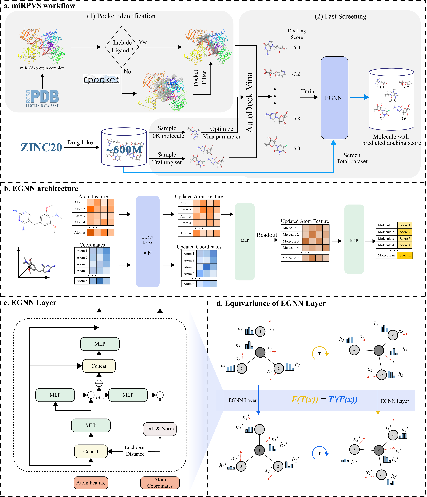

# Equivalent Graph Neural Network-based Accurate and Ultra-fast Virtual Screening of Small Molecules Targeting miRNA-Protein Complex



## Contents

- [Equivalent Graph Neural Network-based Accurate and Ultra-fast Virtual Screening of Small Molecules Targeting miRNA-Protein Complex](#equivalent-graph-neural-network-based-accurate-and-ultra-fast-virtual-screening-of-small-molecules-targeting-mirna-protein-complex)
  - [Contents](#contents)
  - [Software Requirements](#software-requirements)
    - [OS Requirements](#os-requirements)
    - [Python Dependencies](#python-dependencies)
  - [Installation Guide](#installation-guide)
    - [download this repo](#download-this-repo)
    - [install env](#install-env)
  - [Dataset and Processing](#dataset-and-processing)
  - [Ligand Docking](#ligand-docking)
  - [Train model](#train-model)
  - [Model Tuning](#model-tuning)
  - [eval](#eval)
  - [predict](#predict)

If you find it useful, please cite:

**Equivalent Graph Neural Network-based Virtual Screening of Ultra-large chemical libraries  Targeting miRNA-protein complex**
Huabei Wang; Zhimin Zhang; Guangyang Zhang, Ming Wen\* and Hongmei Lu\*.
*Will Published in:*
*DOI:* [](<>)

## Software Requirements

autodock vina

python

### OS Requirements

The package development version is tested on *Linux: Ubuntu 22.04* operating systems.

### Python Dependencies

Dependencies for SMTarRNA:

```
pytorch
pyg
rdkit=2022.09.1
```

## Installation Guide

### download this repo

```
git clone https://github.com/huabei/miRPVS.git
```

### install env

you can install the env via yaml file

```
cd miRPVS
conda env create -f requirements.yaml
```

this project use [ashleve/lightning-hydra-template](https://github.com/ashleve/lightning-hydra-template) as the base project.

## Dataset and Processing

## Ligand Docking

## Train model

> This template is suitable for multi-platform operation, please note that the config/local is configured specifically for different platforms.

You just need to configure your own hyperparameters in config/experiment and then run：

```shell
python src/train.py experiment=exp_name
```

The configuration used for this job is also stored in the config/experiment directory and can be used directly.

## Model Tuning

## eval

The config/eval.yaml file needs to be configured with your data locations, model parameter paths, etc. And run:

```shell
python src/eval.py
```

## predict

The config/predict.yaml file needs to be configured with your data locations, model parameter paths, etc. And run:

```shell
python src/predict.py
```
